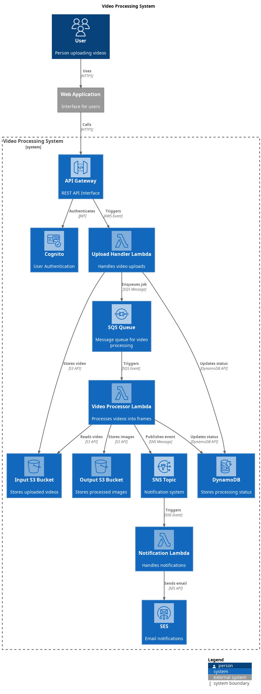

# Video Processing Infrastructure

Este projeto contém a configuração Terraform para provisionar uma arquitetura serverless de processamento de vídeos na AWS.

## Arquitetura do Projeto



## Pré-requisitos

- Terraform v1.0+
- AWS CLI configurado
- Conta AWS com permissões adequadas

## Estrutura do Projeto

```
.
├── main.tf            # Configuração principal
├── variables.tf       # Definição de variáveis
├── outputs.tf         # Outputs do Terraform
└── lambda/           # Código fonte em branco das funções Lambda
    ├── upload_handler.zip
    ├── video_processor.zip
    └── notification_handler.zip
```

## Configuração

1. Inicialize o Terraform:
```bash
terraform init
```

2. Configure as variáveis no arquivo `terraform.tfvars`:
```hcl
aws_region = "us-east-1"
project_name = "video-processor"
environment = "prod"
```

3. Revise o plano de execução:
```bash
terraform plan
```

4. Aplique a configuração:
```bash
terraform init
```

## Recursos Criados

- Cognito User Pool para autenticação
- S3 Buckets para armazenamento de vídeos e imagens
- DynamoDB para status de processamento
- SQS Queue para processamento assíncrono
- SNS Topic para notificações
- Funções Lambda
- API Gateway
- IAM Roles e Policies

## Notas Importantes

1. Certifique-se de ter os arquivos ZIP das funções Lambda no diretório `lambda/` antes de aplicar a configuração.

2. As funções Lambda precisam ser implementadas separadamente. Os arquivos ZIP devem conter o código fonte completo.

3. Para produção, considere:
   - Adicionar encryption em repouso para S3 e DynamoDB
   - Configurar CloudWatch Alarms
   - Implementar backup strategies
   - Adicionar WAF no API Gateway

## Limpeza

Para destruir a infraestrutura:
```bash
terraform destroy
```
